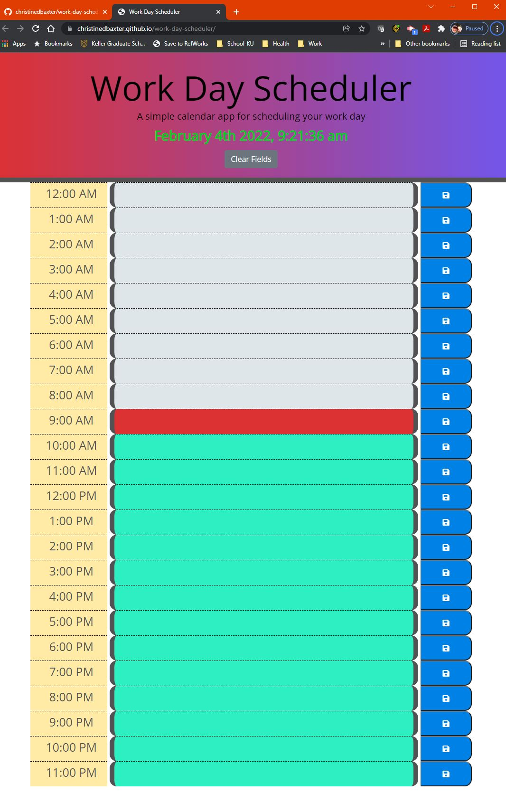

# Third-Party APIs: Work Day Scheduler

## Description

A simple calendar application that allows the user to save events for each hour of the day. This app will run in the browser and feature dynamically updated HTML and CSS powered by jQuery. The [Moment.js](https://momentjs.com/) library is used to work with date and time.

[back to top](#table-of-contents)

## Table of Contents

[Description](#description) | [Installation](#installation) | [Review](#review) | [Usage](#usage) | [License](#license) | [Contributing](#contributing) | [Tests](#tests) | [Questions](#questions)

## Installation

To install necessary dependencies into the node_modules folder, run the following command:

```
npm i
```

[back to top](#table-of-contents)

## Review

**_Acceptance Criteria/Pseudocode_**

- [User Story and Acceptance Criteria](./docs/acceptance-criteria.md)

**_Functional, Deployed Application_**

- [Click to Run Application](https://christinedbaxter.github.io/work-day-scheduler/)

**_Mock-up and Walk-through Animation_**

- Home Screen:
  

- Application Demo</br>
  

**_GitHub Repository_**

- [GitHub Repository URL](https://github.com/christinedbaxter/work-day-scheduler)

[back to top](#table-of-contents)

## Usage

The application is invoked by navigating to the following URL:

```
https://christinedbaxter.github.io/work-day-scheduler/
```

Project folder structure:

```
.
├── assets/         // modular code used by application
├── docs/           // documentation and application animations
├── .gitignore      // indicates folders/files Git should ignore
├── index.html      // contains homepage content
└── package.json
```

[back to top](#table-of-contents)

## License

This project is licensed under the MIT license.

[back to top](#table-of-contents)

## Contributing

[](./docs/code_of_conduct.md#top)

To help make community values explicit, and signal commitment to creating a welcoming and safe environment for everyone, the [Contributor Covenant](./docs/code_of_conduct.md) has been adopted.

[back to top](#table-of-contents)

## Tests

No tests created for this project.

[back to top](#table-of-contents)

## Questions

If you have any questions about the repo, open an issue or contact me directly at christine.d.baxter@live.com. You can find more of my work at [christinedbaxter](https://github.com/christinedbaxter/).

[back to top](#table-of-contents)
